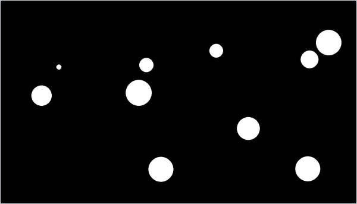

<div align="center">

# Elastic Ball Collisions

*Balls of random mass in a Pygame box, colliding with the exact 2D elastic-collision formula along the line of centres.*




</div>

## About

A small physics experiment kept in three successive versions, named after the original folders (`SimulacionPelotas`, "ball simulation"). The main one, `SimulacionPelotas3.py`, puts ten balls with random masses and velocities in a 1400 × 800 box. Every frame it tests each pair for overlap, and touching pairs exchange momentum through the exact elastic-collision formula for unequal masses. Every 100 frames the console prints the total momentum and kinetic energy, so conservation can be checked by eye. The vector class, the collision response and the integration are written from scratch; Pygame only draws the circles.

## Quick start

```bash
python -m pip install -r requirements.txt
python SimulacionPelotas3.py
```

It runs until the window is closed and prints the conservation totals to the console every 100 frames.

## How it works

- **Mass and size.** Each ball gets a random integer mass from 100 to 10 000 and a radius of $r = \sqrt{m/\pi}$, so its area in pixels equals its mass. Radii range from about 6 to 56 px.
- **Motion.** There is no clock. Every frame each position advances by a fixed fraction of the velocity, whose components start as random integers in $[-20, 20]$:

  ```math
  \mathbf x \leftarrow \mathbf x + 0.05\,\mathbf v
  ```

- **Collisions.** All 45 pairs are checked every frame. When $\lVert \mathbf x_1 - \mathbf x_2 \rVert < r_1 + r_2$, both velocities are replaced at once, changing only their components along the line of centres:

  ```math
  \mathbf v_1' = \mathbf v_1 - \frac{2 m_2}{m_1 + m_2}\,
  \frac{\langle \mathbf v_1 - \mathbf v_2,\ \mathbf x_1 - \mathbf x_2 \rangle}{\lVert \mathbf x_1 - \mathbf x_2 \rVert^2}\,(\mathbf x_1 - \mathbf x_2),
  \qquad
  \mathbf v_2' = \mathbf v_2 - \frac{2 m_1}{m_1 + m_2}\,
  \frac{\langle \mathbf v_2 - \mathbf v_1,\ \mathbf x_2 - \mathbf x_1 \rangle}{\lVert \mathbf x_2 - \mathbf x_1 \rVert^2}\,(\mathbf x_2 - \mathbf x_1)
  ```

  This update conserves both momentum and kinetic energy exactly. The dot product is the `EM` method of the hand-written `Vector2` class.
- **Walls.** When a ball crosses an edge of the window, the matching velocity component changes sign.
- **Conservation log.** The console line shows $\sum m v_x$ (`Momento X`), $\sum m v_y$ (`Momento Y`), $\sum m \lVert \mathbf v \rVert$ (`Momento`, not a conserved quantity) and the kinetic energy $\sum \tfrac12 m \lVert \mathbf v \rVert^2$ (`Energia cinetica`). In a 600-frame test run the energy stayed at the same value to about 15 significant digits, while the momentum components changed at every wall bounce.

## Code map

| Path | Role |
| --- | --- |
| `SimulacionPelotas3.py` | Main version: ten balls of random mass, exact elastic collisions and the conservation log |
| `SimulacionPelotas2.py` | Second version: 72 equal-mass balls on a 12 × 6 grid. It rotates the relative velocity into the contact frame and hands the normal component to the other ball as a deferred force, added after every ball has moved |
| `simulacionpelotas.py` | First stub: a `Sphere` class and a main loop that only measures the frame time. It only prints a test angle |

## Limitations

- Speed is tied to the frame rate: there is no clock or frame cap, so the loop keeps one CPU core busy and runs faster on faster machines.
- Touching pairs are not checked for whether they are approaching, and overlapping balls are never pushed apart. Balls that overlap by more than one step, for example after an unlucky random spawn, get the formula applied every frame and can stay locked together.
- A wall bounce only flips the velocity and does not move the ball back inside, so a collision right next to a wall can leave a ball trembling against it.
- Because of the walls, total momentum is not conserved; only the kinetic energy in the log is a meaningful check.
- The earlier files are kept for history and do not work well. The first stub never reads window events, so its window stops responding. The second version adds every ball to the list twice, so each one moves and collides twice per frame, and it prints the frame number every frame. `addForces` in the third version is a leftover from the second and is never called.

---

<div align="center"><sub>Part of <a href="https://github.com/lnivan">lnivan's projects</a> · <b>Simulations</b></sub></div>
